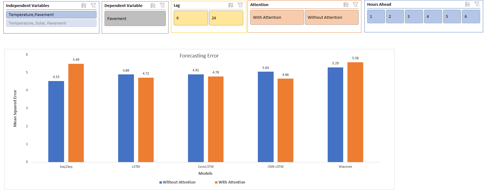

# Pavement Temperature Prediction

The repository deals with the prediction of the pavement temperature in Canada. The repository not only carries the code that is being develop to cater the issue but also contain the results of each model along with their optimal weights. 

## Motivation
Canada is a country that experience high volume of snowfall hence, snow removal of roads holds a pivotal position to ensure saftey of the drivers. The removal is carried out via salt application on the roads and rate of application is dependent on the pavement temperature. The higher the temperature the greater would be the application. Therefore, optimizing this rate is imperative to have optimal resource allocation. The optimization can be carried out by predicting the pavement temperature. 

## Models
A total of 5 models are being developed to tackle the issue. Attention layers are also used for each of the model. The models deployed are the following:

* LSTM
* CNN-LSTM
* ConvLSTM 
* Seq2Seq
* WaveNet

# Tools Used
The following packages are used to carry out the task:

* Numpy
* Pandas
* TensorFlow
* Seaborn
* Matplotlib
* Scikit-Learn

## Results
The results of each combination can be seen in the Results folder in `Dashboard.xlsx`. The file is an interactive file which allows the user to navigate through various variables and getting the desired results. The screenshot below is an illustration of the file. 



## Structure
The repoistory has the following directory tree.


```
Pavement-Temperature-Prediction
├─ Code
│  ├─ Jupyter Notebook
│  ├─ Results
│  ├─ Source
│  ├─ Testing
│  ├─ Weights
├─ Data
│  ├─ Pave_data_1.xlsx
│  └─ Pave_data_cleaned.xlsx
└─ Results
   ├─ Dashboard.xlsx
   ├─ Six Hours Lag
   └─ Twenty Four Hours Lag

```